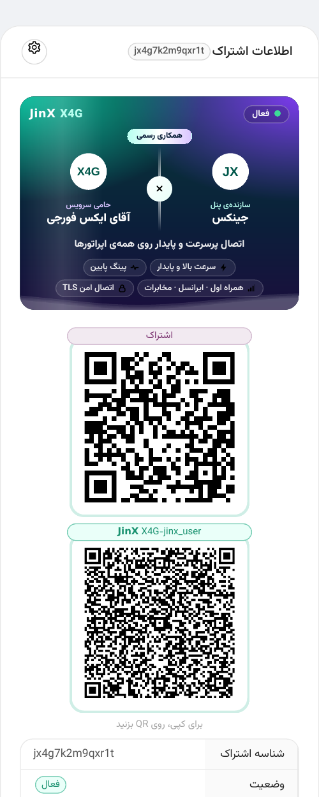
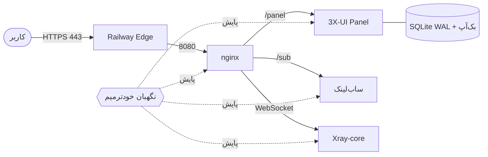

<div align="center">



<br>

<a href="https://github.com/MHSanaei/3x-ui/releases/tag/v2.9.4"></a>
<a href="https://github.com/XTLS/Xray-core"></a>
<a href="https://railway.com"></a>
<a href="https://t.me/Super_Jinx"></a>
<a href="LICENSE"></a>

<br><br>



</div>

<div dir="rtl">


## معرفی

**𝗝𝗶𝗻𝗫 X4G** نسخه‌ی اختصاصی و آماده‌ی پنل محبوب **3X-UI v2.9.4** است که برای اجرای بی‌دردسر روی **Railway** بازطراحی شده است. کافیست پروژه را دیپلوی کنید؛ پنل، اینباند، ساب‌لینک و سیستم نگهبان همه از لحظه‌ی اول آماده‌اند و نیازی به هیچ تنظیم دستی نیست.

این پروژه حاصل **همکاری رسمی جینکس و آقای ایکس فورجی** است.


## ویژگی‌ها

<table>
<tr>
<td width="50%" valign="top">&nbsp;<b>سرعت بالا و پایدار</b><br>&nbsp;تنظیمات بهینه‌ی Xray برای اتصال سریع و بدون افت، مناسب استفاده‌ی همزمان چند کاربر.</td>
<td width="50%" valign="top">&nbsp;<b>پینگ پایین و یکنواخت</b><br>&nbsp;ارسال بی‌تأخیر بسته‌ها و نگه‌داشتن اتصال WebSocket برای جلوگیری از نوسان پینگ.</td>
</tr>
<tr>
<td valign="top">&nbsp;<b>نگهبان خودترمیم</b><br>&nbsp;پایش مداوم Xray، پنل، nginx، ساب‌لینک، اینباند و دیتابیس؛ هر بخشی از کار بیفتد خودکار بازیابی می‌شود.</td>
<td valign="top">&nbsp;<b>سازگار با هر ۴ لوکیشن</b><br>&nbsp;آمستردام، ویرجینیا، کالیفرنیا و سنگاپور؛ هر لوکیشن مستقل و پایدار.</td>
</tr>
<tr>
<td valign="top">&nbsp;<b>پروفایل توربو هلند</b><br>&nbsp;تنظیمات ویژه‌ی سرعت که فقط روی لوکیشن آمستردام فعال می‌شود.</td>
<td valign="top">&nbsp;<b>اینباند محافظت‌شده</b><br>&nbsp;اینباند «𝗝𝗶𝗻𝗫 X4G» قابل حذف یا ویرایش نیست و با پیام رسمی پنل از آن محافظت می‌شود.</td>
</tr>
<tr>
<td valign="top">&nbsp;<b>ساب‌لینک اختصاصی</b><br>&nbsp;صفحه‌ی اشتراک با طراحی ویژه، ۵ زبان، حالت روشن، تیره و خیلی تیره، QR و نصب یک‌کلیکی برنامه‌ها.</td>
<td valign="top">&nbsp;<b>نمای جدا برای گوشی و کامپیوتر</b><br>&nbsp;ساب‌لینک دستگاه را تشخیص می‌دهد و نمای مخصوص همان دستگاه را نشان می‌دهد.</td>
</tr>
</table>


## پیش‌نمایش ساب‌لینک

<div align="center">

</div>


## نصب روی Railway

<details open>
<summary><b>مرحله‌ی ۱: ساخت پروژه</b></summary>

<br>

در Railway گزینه‌ی **New Project** و سپس **Deploy from GitHub repo** را بزنید و همین مخزن را انتخاب کنید.

</details>

<details open>
<summary><b>مرحله‌ی ۲: افزودن Volume (فقط یک بار)</b></summary>

<br>

در تنظیمات سرویس، یک **Volume** با مسیر زیر بسازید. بدون آن، با هر دیپلوی اطلاعات پنل پاک می‌شود.

```
/etc/x-ui
```

</details>

<details open>
<summary><b>مرحله‌ی ۳: دامنه</b></summary>

<br>

در بخش **Networking** گزینه‌ی **Generate Domain** را بزنید و پورت را روی `8080` بگذارید. بقیه‌ی کارها، از جمله تنظیم ساب‌لینک با همین دامنه، خودکار انجام می‌شود.

</details>

<details open>
<summary><b>مرحله‌ی ۴: انتخاب لوکیشن</b></summary>

<br>

در **Settings › Regions** لوکیشن سرویس را انتخاب کنید. برای هر لوکیشن یک سرویس جدا (با Volume مخصوص خودش) بسازید. روی آمستردام (`europe-west4`) پروفایل توربو خودکار فعال می‌شود.

</details>

<details open>
<summary><b>مرحله‌ی ۵: ورود به پنل</b></summary>

<br>

آدرس مخفی پنل در **لاگ‌های Railway** نمایش داده می‌شود. نام کاربری و رمز پیش‌فرض:

| نام کاربری | رمز عبور |
|:---:|:---:|
| `admin` | `admin` |

> **توصیه‌ی امنیتی:** پس از اولین ورود، رمز عبور را از تنظیمات پنل تغییر دهید.

</details>


## متغیرهای اختیاری

هیچ متغیری لازم نیست؛ این‌ها فقط برای شخصی‌سازی هستند.

| متغیر | کاربرد | پیش‌فرض |
|:---|:---|:---:|
| `JX_PANEL_PATH` | آدرس مخفی پنل (مثلا `/my-panel/`) | تصادفی |
| `JX_ADMIN_USER` / `JX_ADMIN_PASS` | نام کاربری و رمز، فقط در اولین اجرا | `admin` / `admin` |
| `JX_DOMAIN` | دامنه‌ی اختصاصی به جای دامنه‌ی Railway | خودکار |
| `JX_TURBO` | `on` یا `off` برای پروفایل توربو | `auto` (فقط هلند) |
| `JX_IPV6` | `off` برای خاموش کردن IPv6 | `auto` |


## ساختار پروژه

همه‌ی فایل‌ها کنار هم در یک پوشه هستند:

| فایل | کاربرد |
|:---|:---|
| `Dockerfile` | ساخت ایمیج بر پایه‌ی 3X-UI v2.9.4 |
| `railway.json` | تنظیمات دیپلوی Railway |
| `bootstrap.py` | راه‌اندازی خودکار پنل، ساب‌لینک و اینباند |
| `guard.py` | نگهبان خودترمیم |
| `helper.py` | سلامت سرویس و ساخت QR |
| `inbound.py` / `settings.py` | اینباند قفل‌شده و تنظیمات اجباری |
| `render.py` / `nginx.conf.tpl` | پیکربندی nginx روی پورت 8080 |
| `xraytpl.py` | تنظیمات سرعت هسته‌ی Xray |
| `common.py` / `init.sh` | توابع مشترک و شروع سرویس‌ها |
| `sub.html` / `lock.js` | صفحه‌ی ساب‌لینک و قفل اینباند در پنل |
| `segno-*.py` | کتابخانه‌ی ساخت QR |
| `*.svg` / `*.png` | تصویرهای همین صفحه |


## عیب‌یابی

<details>
<summary><b>دیپلوی با خطای Healthcheck تمام شد</b></summary>
<br>
معمولا یعنی Volume روی <code>/etc/x-ui</code> وصل نشده یا پورت دامنه <code>8080</code> نیست. هر دو را بررسی و دوباره دیپلوی کنید.
</details>

<details>
<summary><b>صفحه‌ی <code>Not Found</code> می‌بینم</b></summary>
<br>
آدرس اصلی دامنه عمدا خالی است. پنل فقط روی آدرس مخفی‌ای باز می‌شود که در لاگ Railway نوشته شده است.
</details>

<details>
<summary><b>کانفیگ‌ها وصل نمی‌شوند</b></summary>
<br>
پنل را یک بار با دامنه‌ی Railway باز کنید تا دامنه ثبت شود (یا دوباره دیپلوی کنید). سپس لینک ساب را در برنامه به‌روزرسانی کنید.
</details>

<details>
<summary><b>بعد از دیپلوی جدید کاربرها پاک شدند</b></summary>
<br>
Volume وصل نبوده است. Volume را روی <code>/etc/x-ui</code> بسازید؛ از آن به بعد همه چیز ماندگار است و بک‌آپ خودکار هم داخل همان ذخیره می‌شود.
</details>


## معماری




## لوکیشن‌ها

| لوکیشن | منطقه‌ی Railway | پروفایل |
|:---:|:---:|:---:|
| آمستردام، هلند | `europe-west4-drams3a` | **توربو** |
| ویرجینیا، آمریکا | `us-east4-eqdc4a` | استاندارد پایدار |
| کالیفرنیا، آمریکا | `us-west2` | استاندارد پایدار |
| سنگاپور | `asia-southeast1-eqsg3a` | استاندارد پایدار |


## سوالات متداول

<details>
<summary><b>چرا فقط VLESS + WebSocket + TLS؟</b></summary>
<br>
Railway فقط پورت HTTPS (۴۴۳) را به بیرون باز می‌کند. پروتکل‌هایی مثل Reality، TCP خام و Hysteria روی این زیرساخت قابل اجرا نیستند؛ VLESS روی WebSocket با TLS پایدارترین و سریع‌ترین گزینه است.
</details>

<details>
<summary><b>اگر بخشی از پنل از کار بیفتد چه می‌شود؟</b></summary>
<br>
نگهبان خودترمیم در چند ثانیه همان بخش را بازیابی می‌کند، بدون اینکه کاربران قطع شوند یا نیاز به دخالت شما باشد.
</details>

<details>
<summary><b>چرا لوکیشن‌ها کاربران جداگانه دارند؟</b></summary>
<br>
هر لوکیشن یک سرویس مستقل با دیتابیس خودش است؛ کاربر هر لوکیشن فقط روی همان لوکیشن کار می‌کند.
</details>

<details>
<summary><b>پینگ چقدر است؟</b></summary>
<br>
پینگ به اپراتور، مسیر اینترنت و لوکیشن انتخابی بستگی دارد. این پروژه تمام تنظیمات سمت سرور را برای کمترین و یکنواخت‌ترین پینگ بهینه کرده است؛ بهترین نتیجه معمولاً روی هلند به دست می‌آید.
</details>


## سپاس و اعتبار

- **جینکس**: طراحی و توسعه‌ی پنل، ساب‌لینک و سیستم نگهبان
- **آقای ایکس فورجی**: حامی رسمی سرویس
- [**MHSanaei/3x-ui**](https://github.com/MHSanaei/3x-ui): پنل پایه (GPL-3.0)
- [**XTLS/Xray-core**](https://github.com/XTLS/Xray-core): هسته‌ی اتصال

> این پروژه بر پایه‌ی 3X-UI ساخته شده و مانند نسخه‌ی اصلی تحت مجوز **GPL-3.0** منتشر می‌شود.

</div>

<br>

<div align="center">

<a href="https://t.me/Super_Jinx"></a>

<br><br>


</div>
